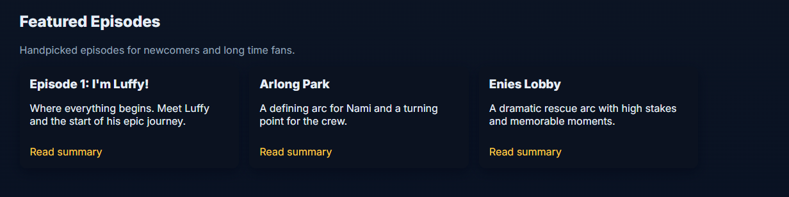
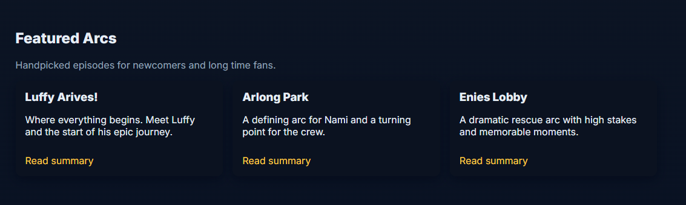

**Building a web service container:**
  - Explanation and links to web site content
	- The web site content I created using chatgpt consisted of a [index](web-content/index.html) and [about](web-content/about.html) html file that housed the content of the web site and [styles](styles.css) file to handle the apperance and layout. I had to adjust both the index and styles file for my image.
  - Explanation of and link to `Dockerfile`
	- The dockerfile sets up the container environment/base image and copied over our web-content
[Dockerfile](web-content/Dockerfile)
  - Instructions to build and push container image to your DockerHub repository
	- I built the container with `docker build -t larryrsmith/project4:latest .` and pushed using `docker push larryrsmith/project4:latest`. Ok this time I figured it out and used the PAT logining in with `docker login -u larryrsmith` the PAT is safer because they expire.
  - Link to DockerHub repository with your site image
	- [DockerHub repository](https://hub.docker.com/repository/docker/larryrsmith/project4/general)
  - How to run the container that will serve the web application from the image build by the `dockerfile`
	- So first I had to pull the docker image to my instance `docker pull larryrsmith/project4:latest` then all I had to do was run it `docker run -d -p 8080:80 larryrsmith/project4:latest` Host port 8080 container port 80

**GitHub Actions and DockerHub**
  - Configuring GitHub Repository Secrets:
	- To create a PAT, I went and logged in to dockerhub. I then went to `account settings` there I clicked on `Personal access tokens` where you can click `Generate new token` to creat the new token for github
	- To create my secrets I went to `github` -> `setting` -> `Secrets and variables` -> `Actions` -> `New repository secret` then filled out what I wanted my new secrets to be.
	- The first secret was my docker username which will provide my docker username. The second holds my PAT to allow github to log into my dockerhub with both the user name and PAT. 
  - CI with GitHub Actions
	- So the Workflow trigger is what you set up to cause the workflow to take action. Like in the one I set up I want to to trigger when there is a push to the main branch. So the workflow will only trigger if there is a push to the main branch.
	- So workflow steps is the flow of actions being taken. My flow steps starts with checkout which pulls my repo into the runner to be used. Then sets up docker buildx, logs into docker using my secrets, and finally builds and pushes to dockerhub using my dockerfile.
	- Explanation / highlight of values that need updated if used in a different repository
		- You would need to change how to navigate to the location of the Dockerfile. You would also need to check your secrets an see if they need updated. Might be the same you never know. I would make mine the same.
		- Transfer all files and folders including Dockerfile and .github/workflows/ that you are going to be using if its a new repository. Make sure to set up your secrets.
	- [WorkFlow](https://github.com/WSU-kduncan/cicdf25-Larryrsmithusmc/blob/main/Project4/docker-workflow.yml)
  - Testing & Validating
	- For me I checked in my repo first under the actions tab. I had about 5 failed attempts before I got it working. Then after it was working I check on dockerhubs end by looking the last pushed time.
	- I went and killed the old container with the old content and started a new one. You could set up a bash script for this and I think thats what the next project is doing with hooks. I just did it manually. `docker stop c00801132e92` -> `docker pull larryrsmith/project4:latest` -> `docker run -d -p 8080:80 larryrsmith/project4:latest` and everything worked.
	- [DockerHub repository](https://hub.docker.com/repository/docker/larryrsmith/project4/general)

**Semantic Versioning**
  - Generating tags
	- How to see tags in a git repository
	- How to generate a tag in a git repository
	- How to push a tag in a git repository to GitHub
  - Semantic Versioning Container Images with GitHub Actions
	- Now it is only triggered when a git tag is pushed 
	- So workflow steps is the flow of actions being taken. My flow steps starts with checkout which pulls my repo into the runner to be used. Then sets up docker buildx, logs into docker using my secrets, docker meta data asign image and tags with type ref event tag `This type handles Git ref (or reference) for the following events:tag ; eg. refs/tags/v1.0.0` using semver for patterns, and finally builds and pushes to dockerhub using my dockerfile attaching metadata/version to it.
	- Explanation / highlight of values that need updated if used in a different repository
	  - Same as before You would need to change how to navigate to the location of the Dockerfile. You would also need to check your secrets an see if they need updated. Might be the same you never know. I would make mine the same
	  - Same as before Transfer all files and folders including Dockerfile and .github/workflows/ that you are going to be using if its a new repository. Make sure to set up your secrets.
	- [WorkFlow](https://github.com/WSU-kduncan/cicdf25-Larryrsmithusmc/blob/main/Project4/docker-workflow.yml)
  - Testing & Validating
	- To test this I did a normal push without a tag to see if anything happened in the actions tab. When nothing happened I then pushed with a tag. The workflow kicked in and actions showed a inprogress/completed workflow after a little time.
	- Same as before I went and killed the old container with the old content and started a new one. You could set up a bash script for this and I think thats what the next project is doing with hooks. I just did it manually. `docker stop c00801132e92` -> `docker pull larryrsmith/project4:latest` -> `docker run -d -p 8080:80 larryrsmith/project4:latest` and everything worked. The changes took place on the website.
	- 
	- 
	- Link to your DockerHub repository with evidence of the tag set
