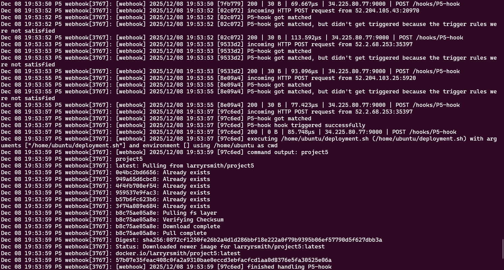

## Project Description & Diagram

1. Continuous Deployment Project Overview
  - The goal of this project was to implament Continous deployment of a docker container using webhooks via dockerhub and github.
  - The tools used for this project, github workflow that triggered when a push with tags was pushed to github resualting in a docker build and push, dockerhub webhooks that sent webhook payloads to the ec2 instance when a push occured, webhook to recive the payload on the ec2 instance and trigger when conditions where met to run a script, a bash script to stop, rm, pull, run a docker container. All resaulting in continous deployment of our web site updates.

## Script a Refresh

1. EC2 Instance Details: [I used this yml file](P5.yml)
  - AMI information 
	- ami-0360c520857e3138f # Ubuntu Server 24.04 LTS (HVM), SSD Volume Type
  - Instance type 
	- t2.micro
  - Recommended volume size
	- I forgot to do this part, mine just used the default 8
  - Security Group configuration
	- I set this to allow home, vpc, and school ips on port 22. I left the SSHparameter in there and it looks like its allowing all to ssh port 22. I also allowed all ips on ports 80, 8080, and 9000 for our container and hooks.
  - Security Group configuration justification / explanation
	- I made sure I would be able to ssh from school and home to the ec2 instance as well as go to our webpage port 8080 and listen for hooks on port 9000.
2. Docker Setup on OS on the EC2 instance
  - How to install Docker for OS on the EC2 instance
	- I set it up in the `P5.yml` file using `sudo apt install -y docker.io` `sudo usermod -aG docker ubuntu` 
  - Additional dependencies based on OS on the EC2 instance
	- I had it `apt update` and install `apt install -y git` just incase but other then that just installed webhook when I got to that part.
  - How to confirm Docker is installed and that OS on the EC2 instance can successfully run containers
	- To test this I did `docker ps -a` then I used my newly created script and it worked wonders. I just visted the website when it completed.
3. Testing on EC2 Instance
  - How to pull container image from DockerHub repository
	- `docker pull larryrsmith/project5:latest`
  - How to run container from image
	- `docker run -d --restart always --name project5 -p 8080:80 larryrsmith/project5:latest` you could run it as -it which allows you access interactivly in a bash shell. I just ran mine in -d detached int he background the whole time because I wasnt really messing with the container itself and would recommend running it this way after testing is done.
  - How to verify that the container is successfully serving the web application
	- Visited the website at http://34.225.80.77:8080
4. Scripting Container Application Refresh
  - Description of the bash script
	- My bash script stops the container, removes the container to free up the container name, pulls the latest container image from dockerhub, and runs a new container in detached mode, set to restart always on ec2 instance start up, with the name project5, on host port 8080 container port 80, from the lastest image pulled.  
  - How to test / verify that the script successfully performs its taskings
	- I tested this by making a small change to my web content. I then ran the script and when it finished I checked the website for its updates to verify that it worked.
  - [Bash script](deployment/deployment.sh)

## Listen

1. Configuring a webhook Listener on EC2 Instance
  - How to install adnanh's webhook to the EC2 instance
	- `sudo apt install webhook`
  - How to verify successful installation
	- `webhook --version`
  - Summary of the webhook definition file
	- I set up a id name `P5-hook` For the command I gave it the path to my script `/home/ubuntu/depolment.sh` and told it to work out of my `/home/ubuntu` directory. I set up two trigger rules first to check that the repo name in the payload was `larryrsmith/project5` and that it has the push tag `latest`
  - How to verify definition file was loaded by webhook
	- `webhook -hooks /home/ubuntu/hooks.json -verbose` `[webhook] 2025/12/08 17:43:31 found 1 hook(s) in file` `[webhook] 2025/12/08 17:43:31   loaded: P5-hook`
  - How to verify webhook is receiving payloads that trigger it
	- `curl http://localhost:9000/hooks/P5-hook` `sudo journalctl -u webhook -f`
	  - how to monitor logs from running webhook
		- I just had one instance with the logs opened and sent out request from another instance and watched them come in using `webhook -hooks /home/ubuntu/hooks.json -verbose` Then later I just pushed new tags and watched the logs as they came in using `sudo journalctl -u webhook -f` 
	  - what to look for in docker process views
		- check that the container is running and the time stamps `docker ps -a` or you could use `docker logs project5` but I didnt do that.
  - [Definition file](deployment/hooks.json)
2. Configure a webhook Service on EC2 Instance
  - Summary of webhook service file contents
	- It has some defult content then the parts that I changed was condition path to the path of my json file under unit and under service I canged the execstart part so on start i uses my hooks and start monitoing logs. 
  - How to enable and start the webhook service
	- `sudo systemctl enable webhook` `sudo systemctl start webhook` To ensure all the changes occured `sudo systemctl stop webhook` `sudo systemctl daemon-reload` `sudo systemctl start webhook`
  - How to verify webhook service is capturing payloads and triggering bash script
	- `sudo journalctl -u webhook -f` checked the logs

  - [Service File](deployment/webhook.service.file)

## Send a payload

1. Configuring a Payload Sender
  - Justification for selecting GitHub or DockerHub as the payload sender
	- I chose DokcerHub bacause in your class it seemed like the easier one to perform and it turned out to be very simple.
  - How to enable your selection to send payloads to the EC2 `webhook` listener
	- To enable it to send payloads, I went to dockerhub website, clicked on my project5 repository, selected webhooks, named it and pasted my url `http://34.225.80.77:9000/hooks/P5-hook` then clicked the add sign and done.
  - Explain what triggers will send a payload to the EC2 `webhook` listener
	- Anytime images are pushed dockerhub will trigger a payload to be sent. This is why we needed to set up trigger rules on our hooks.
  - How to verify a successful payload delivery
	- In the logs any time you have a `incoming HTTP POST request` and it checks your triggers after you have recived a successful payload
  - How to validate that your webhook *only triggers* when requests are coming from appropriate sources (GitHub or DockerHub)
	- In the logs when a trigger rule matches its set condition you get the message `P5-hook got matched` When a trigger rule does not match the set condition you recive the message `P5-hook got matched, but didn't get triggered because the trigger rules were not satisfied` when both triggers are successfully matched you recive the message `P5-hook hook triggered successfully`

## Resources

  - Used you videos for the most part. There was one part I asked chatgpt "show me the full path to the webhook service file so I can make changes to it" It gave me this `sudo nano /usr/lib/systemd/system/webhook.service` and I was able to continue from there from the videos.
